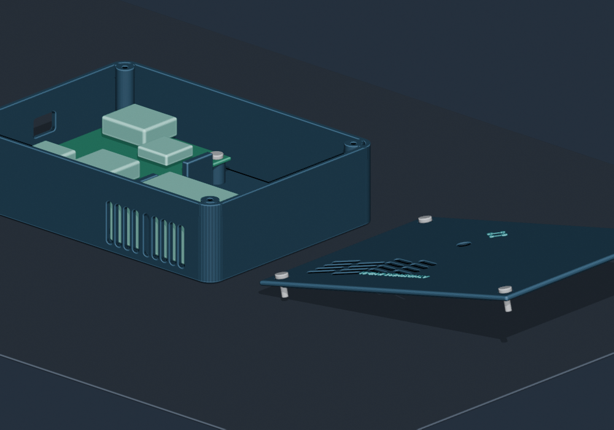
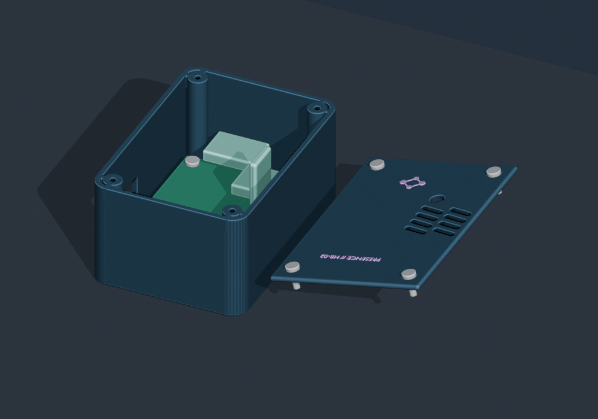
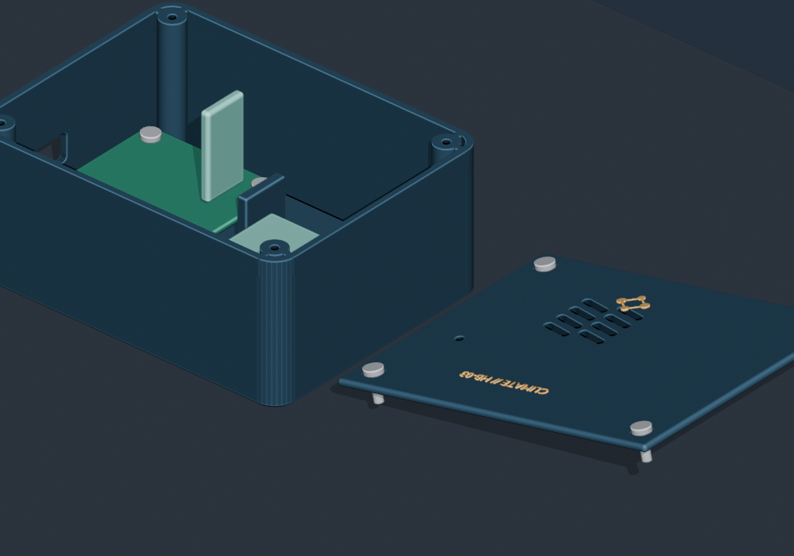

# HomeBrain Sensor Fleet

**PCB manufacturing hold — 2026-09-06:** Do not order any of the three motherboard ZIPs or reprint their paired cases yet. See the [pre-order review](../../hardware/homebrain-sensors/motherboards/PREORDER-REVIEW.md) for unresolved geometry and electrical validation requirements. This supersedes order-ready language below.

This project turns the three Seeed Studio XIAO ESP32-C6 boards into three different HomeBrain-native devices. All three run the same firmware image; the profile selected in **Settings → Sensor Fleet** controls the attached sensors, reporting cadence, and power behavior.

> **Final assembly architecture:** all three devices now use separate [purpose-built HomeBrain motherboards](../../hardware/homebrain-sensors/motherboards/README.md). Every purchased module is soldered directly into its labeled footprint; shared power, I²C, UART, and battery-sense nets are PCB copper. The only flexible internal leads are the PMS5003 factory keyed cable and the pouch battery's factory lead. The older large wiring sheets remain breadboard/bench references only.

> **Climate battery divider:** the Climate motherboard uses two 200 kΩ 1% resistors: BAT+ → R1 → D0/A0 → R2 → GND. The XIAO keeps its factory 1×7 side headers; two short rigid posts made from saved resistor-lead offcuts connect its underside `BAT−/BAT+` pads through motherboard `XB1/XB2`—no loose jumpers.

| Device | Sensors | Power | Default reporting | Primary purpose |
| --- | --- | --- | --- | --- |
| **Atmosphere Air Station** | BME680, SCD41, PMS5003, VEML7700 | External USB-C, continuous | 30 seconds | True CO₂, PM1/2.5/10, pressure, light, climate, and relative VOC trend |
| **Presence Pod** | LD2410C, DHT11, VEML7700 | External USB-C, continuous | 15 seconds plus presence transitions | Moving and stationary human presence, distance/energy, light, and climate |
| **Climate Pod** | DHT11, LiPo voltage monitor | 3.7 V 1000 mAh LiPo | 5 minutes, deep sleep | Small cordless temperature/humidity, comfort, mold-risk, and battery telemetry |

## Two additional power purchases

The Atmosphere Air Station and Presence Pod need continuous power. Use an external listed wall adapter; do **not** put mains wiring or a bare AC/DC module inside a printed PLA/PETG case.

- Buy **two** [Anker 323 33 W USB-C/USB-A wall chargers (ASIN B0B2MMYZPL)](https://www.amazon.com/dp/B0B2MMYZPL). Each station gets its own charger. A USB-C PD source remains at safe 5 V unless a higher voltage is negotiated, and either port has ample current for these nodes.
- Buy **one pack** of [UGREEN USB-C to USB-C cables (ASIN B0BPXKJSWY)](https://www.amazon.com/dp/B0BPXKJSWY); choose the 6.6 ft length unless the outlet is next to the sensor. Two cables are used and one is a spare.

A quality 5 V/2 A-or-greater USB supply and a known-good data-capable USB-C cable already on hand are also acceptable. The firmware is flashed through the same cable.

Estimated worst-case low-voltage budgets:

| Device | Approximate peak | Supply design point |
| --- | ---: | ---: |
| Atmosphere Air Station | 0.6–0.8 A at 5 V | 5 V, 2 A minimum |
| Presence Pod | 0.4–0.6 A at 5 V | 5 V, 1 A minimum; 2 A preferred |
| Climate Pod | Short Wi-Fi peaks from the LiPo | XIAO onboard 120 mA LiPo charger |

The wall adapters stay outside the enclosures. Only USB 5 V, 3.3 V, and battery voltage are present inside.

## Purchased hardware assignment

| Purchased item | Assignment |
| --- | --- |
| 3 × XIAO ESP32-C6 | One in each device |
| 2 × DHT11 modules | Presence Pod and Climate Pod |
| 1 × BME680 | Atmosphere Air Station |
| 4 × 1000 mAh LiPo | One Climate Pod battery; three spares/future pods |
| 1.25 mm 2-pin pigtails | One mating lead soldered directly into Climate motherboard `J2` |
| 200 kΩ 1% resistors | Two battery-divider resistors; the rest are spares |
| 1 × SCD41 | Atmosphere Air Station |
| 2 × VEML7700 | Atmosphere Air Station and Presence Pod |
| 3 × LD2410C | One Presence Pod; two spares/future room pods |
| 1 × PMS5003 + cable breakout | Atmosphere Air Station |

Bench consumables assumed: soldering iron, solder, flux, desoldering braid if the Atmosphere XIAO's breadboard pins need adjustment, and a multimeter. The final motherboards do not use Dupont or JST-XH sensor harnesses. No inserts, nuts, standoffs, or specialty case hardware are used.

## Radio and antenna

**No external antennas are required and there is nothing additional to order.** The XIAO ESP32-C6 includes an onboard 2.4 GHz ceramic antenna; its U.FL connector is an optional alternate antenna port. Seeed documents the onboard antenna as the default, selected with RF-switch power GPIO3 low and antenna-select GPIO14 low. The pinned Arduino-ESP32 3.3.7 XIAO board variant performs that selection in `initVariant()` before this firmware's `setup()` runs.

The house Wi-Fi must offer a 2.4 GHz network. An external antenna can improve 2.4 GHz signal strength in a difficult location, but it cannot add 5 GHz support.

Each motherboard has a copper-free keep-out below and forward of the XIAO ceramic antenna, and each case preserves that air/plastic corridor. The XIAO USB end faces the case opening; no antenna lead, external bulkhead, or case opening is used.

HomeBrain already records each node's Wi-Fi RSSI. Test the completed sensor in its intended room before considering an external antenna; an occasional weak reading is not a reason to change hardware. If a final location shows persistently poor RSSI and repeated reconnects after repositioning the sensor, the compatible fallback is Seeed's [2.4 GHz Rod Antenna for XIAO, SKU 103990623](https://www.seeedstudio.com/2-4GHz-2-81dBi-Antenna-for-XIAO-ESP32C3-p-5475.html), but that is intentionally **not** part of the purchase list or current case design.

## One additional local fastener pack

The three redesigned cases use 24 identical screws: four per motherboard and four per lid. Buy **two 16-packs total** of [Everbilt #4 × 3/8 in. zinc-plated Phillips pan-head sheet-metal screws (Home Depot model 824681, Store SKU 1006540029)](https://www.homedepot.com/p/317479260). Since the original 16-pack was already ordered, add **one more local 16-pack**. Eight screws remain spare.

Every screw threads directly into a printed plastic boss with an open, 2.35 mm blind pilot. Motherboard screws pass through the PCB's 3.4 mm grounded clearance holes; lid screws use recessed head seats. No brass inserts, nuts, washers, standoffs, or online-only fasteners are required. Use a hand Phillips screwdriver and stop when snug.

## Electrical rules

1. Disconnect USB and the LiPo before soldering.
2. The LiPo connector's physical shape does **not** guarantee polarity. Confirm that its red lead is positive with a multimeter before connecting it to the XIAO BAT pads.
3. Never connect 5 V to a XIAO GPIO, the BME680 signal pins, the VEML7700 signal pins, or the DHT11 data pin.
4. Power the PMS5003 and LD2410C from USB 5 V/VBUS, never from the XIAO 3V3 pin.
5. Power the I²C breakouts and DHT11 from 3V3.
6. Keep the XIAO antenna end clear of the battery, PMS5003 metal shell, and dense wire bundles.
7. The BME680 reports a broad, relative gas/VOC trend. It is not a CO₂ sensor and the firmware never labels it as one. The SCD41 supplies real CO₂; the PMS5003 supplies particulate values.

## XIAO pin allocation

| XIAO label | ESP32-C6 GPIO | Fleet use |
| --- | ---: | --- |
| D0 / A0 | GPIO0 | Climate Pod battery divider midpoint |
| D1 | GPIO1 | SERVICE: short to GND for 1.5 seconds during boot to erase provisioning |
| D2 | GPIO2 | DHT11 data |
| D3 | GPIO21 | Switched 3.3 V power for DHT11 |
| D4 | GPIO22 | I²C SDA |
| D5 | GPIO23 | I²C SCL |
| D6 | GPIO16 | UART TX to PMS5003 or LD2410C RX |
| D7 | GPIO17 | UART RX from PMS5003 or LD2410C TX |
| 3V3 | — | BME680, SCD41, VEML7700, and DHT11 power |
| 5V / VBUS | — | PMS5003 or LD2410C power; present while USB is connected |
| GND | — | Common low-voltage ground |
| BAT+ / BAT− pads | — | Climate Pod LiPo only |

## Motherboard assembly and electrical diagrams

- **Atmosphere:** [assembly PNG](../../hardware/homebrain-sensors/motherboards/generated/atmosphere/homebrain-atmosphere-motherboard-assembly.png) · [net schematic PNG](../../hardware/homebrain-sensors/motherboards/generated/atmosphere/homebrain-atmosphere-motherboard-schematic.png) · [1:1 fit template](../../hardware/homebrain-sensors/motherboards/generated/atmosphere/homebrain-atmosphere-motherboard-fit-check.svg) · [Gerber ZIP](../../hardware/homebrain-sensors/motherboards/generated/atmosphere/homebrain-atmosphere-motherboard-gerbers.zip)
- **Presence:** [assembly PNG](../../hardware/homebrain-sensors/motherboards/generated/presence/homebrain-presence-motherboard-assembly.png) · [net schematic PNG](../../hardware/homebrain-sensors/motherboards/generated/presence/homebrain-presence-motherboard-schematic.png) · [1:1 fit template](../../hardware/homebrain-sensors/motherboards/generated/presence/homebrain-presence-motherboard-fit-check.svg) · [Gerber ZIP](../../hardware/homebrain-sensors/motherboards/generated/presence/homebrain-presence-motherboard-gerbers.zip)
- **Climate:** [assembly PNG](../../hardware/homebrain-sensors/motherboards/generated/climate/homebrain-climate-motherboard-assembly.png) · [net schematic PNG](../../hardware/homebrain-sensors/motherboards/generated/climate/homebrain-climate-motherboard-schematic.png) · [1:1 fit template](../../hardware/homebrain-sensors/motherboards/generated/climate/homebrain-climate-motherboard-fit-check.svg) · [Gerber ZIP](../../hardware/homebrain-sensors/motherboards/generated/climate/homebrain-climate-motherboard-gerbers.zip)

The old universal-carrier/harness files are explicitly deprecated and must not be ordered. The earlier direct-wire physical sheets remain available as [Atmosphere bench wiring](./wiring-atmosphere.png), [Presence bench wiring](./wiring-presence.png), and [Climate bench wiring](./wiring-climate.png) only for diagnosing the current breadboard.

The physical references used by the diagram generator are:

| Part | Exact purchase reference | Pin/hole order in the drawing |
| --- | --- | --- |
| XIAO ESP32-C6 | [ASIN B0DJ6N55FX](https://www.amazon.com/dp/B0DJ6N55FX) | Component side, USB-C at top: left D0…D6; right VBUS, GND, 3V3, D10…D7. Separate underside BAT−/BAT+ view. |
| DIYables DHT11 | [ASIN B0DQ3PPGH2](https://www.amazon.com/dp/B0DQ3PPGH2) | Blue sensor at top; bottom pins `+`, `OUT`, `−` left-to-right. |
| hiBCTR BME680 | [ASIN B0GXHGYRN2](https://www.amazon.com/dp/B0GXHGYRN2) | Sensor left; right holes `VCC`, `GND`, `SCL`, `SDA`, `SDO`, `CS` top-to-bottom. |
| Teyleten Robot SCD41 | [ASIN B0C622SS34](https://www.amazon.com/dp/B0C622SS34) | Physical board: sensor top; bottom holes `GND`, `VDD`, `SCL`, `SDA` left-to-right. Diagram: rotated 90° clockwise, so those holes appear at left in the same order top-to-bottom. |
| HiLetgo VEML7700 | [ASIN B09KGYF83T](https://www.amazon.com/dp/B09KGYF83T) | Physical board: sensor top; bottom holes `VIN`, `3Vo`, `GND`, `SCL`, `SDA` left-to-right. Diagram: rotated 90° clockwise, so those holes appear at left in the same order top-to-bottom. |
| Qoroos LD2410C | [ASIN B0F1F97422](https://www.amazon.com/dp/B0F1F97422) | Antenna/component face up; `TX`, `RX`, `OUT`, `GND`, `VCC` left-to-right with silkscreen readable. |
| PMS5003 cable breakout | [ASIN B0BG612GB2](https://www.amazon.com/dp/B0BG612GB2) | Actual purchased red board has a factory-installed 1×8 male header on its left edge and keyed socket on its right: `VCC(+5V)`, `GND`, `SET`, `RXD`, `TXD`, `RESET`, `NC`, `NC` top-to-bottom. |
| PMS5003 | [ASIN B0BHZTCK8J](https://www.amazon.com/dp/B0BHZTCK8J) | Supplied keyed 8-wire cable remains intact between sensor and red breakout. |
| LiPo + mating pigtail | [Battery B0FZSR8MQY](https://www.amazon.com/dp/B0FZSR8MQY) · [Pigtail B0DMT6VZVC](https://www.amazon.com/dp/B0DMT6VZVC) | Use the 1.25 mm half that physically mates; connector polarity must be measured. Shell orientation and wire color are not proof. |

### Direct-solder motherboard contracts

The authoritative, hole-by-hole tables and build instructions are in the [dedicated motherboard guide](../../hardware/homebrain-sensors/motherboards/README.md). Key rules:

- Every headered sensor board and every XIAO uses its factory-installed straight male pins through the labeled motherboard footprint. Solder from the motherboard underside, inspect, then trim the excess.
- Atmosphere `J4` receives the purchased red PMS breakout itself. Remove its temporary Dupont jumper leads, insert all eight factory male pins directly through `J4`, solder on the motherboard underside, inspect, and then trim only the excess protruding pin length. Only `VCC`, `GND`, `RXD`, and `TXD` have functional copper routes. The factory keyed cable remains intact between that breakout and the PMS5003.
- Presence rotates the LD2410C so its antenna end overhangs the PCB edge; `TX→D7/RX` and `RX←D6/TX` are intentionally crossed.
- Climate inserts the XIAO's two factory 1×7 rows through `U1`. Before insertion, two straight saved resistor-lead posts are soldered to XIAO underside `BAT−/BAT+`, guided through `XB1/XB2`, and soldered from below; the 200 kΩ divider is entirely on-board.

Both Climate resistors are required. Together they form a 1:2 divider, so a fully charged 4.2 V cell presents about 2.1 V at D0/A0. Verify the pigtail polarity with a multimeter before mating the battery.

D1 remains an optional service contact only: no permanent wire is shown or required. To reset provisioning, temporarily short D1 to GND during boot as described below.

## Printable enclosures

The finished Blender source, six print-ready STLs, exploded previews, dimension source, and independent mesh verifier live in [`hardware/homebrain-sensors/enclosures`](../../hardware/homebrain-sensors/enclosures/README.md). Each device uses four direct-thread screws for its motherboard and four for its lid. The AC adapters remain completely external.


| Case | Body STL | Lid STL | Outside size |
| --- | --- | --- | --- |
| Atmosphere | [`atmosphere-body.stl`](../../hardware/homebrain-sensors/enclosures/generated/atmosphere-body.stl) | [`atmosphere-lid.stl`](../../hardware/homebrain-sensors/enclosures/generated/atmosphere-lid.stl) | 146 × 104 × 38 mm |
| Presence | [`presence-body.stl`](../../hardware/homebrain-sensors/enclosures/generated/presence-body.stl) | [`presence-lid.stl`](../../hardware/homebrain-sensors/enclosures/generated/presence-lid.stl) | 66 × 94 × 48 mm |
| Climate | [`climate-body.stl`](../../hardware/homebrain-sensors/enclosures/generated/climate-body.stl) | [`climate-lid.stl`](../../hardware/homebrain-sensors/enclosures/generated/climate-lid.stl) | 110 × 84 × 48 mm |







The editable source is [`homebrain-sensor-enclosures.blend`](../../hardware/homebrain-sensors/enclosures/generated/homebrain-sensor-enclosures.blend). The Blender file retains colored reference motherboards, soldered-module envelopes, and all 24 reference screws, while the STLs contain only printable geometry. Each motherboard is rigidly fastened to four open blind plastic posts. Two 18 mm-high rear walls carry USB insertion force. The cases also include connector-aligned USB openings, sensor-specific ventilation, recessed lid-screw seats, antenna keep-outs, and a 1.2 mm radar window in front of the LD2410C.

The dedicated-motherboard revision changed every mounting feature and all three outside envelopes. Reprint the current body **and lid** for all devices; earlier carrier-case parts are incompatible. The same common #4 screws remain correct. Exact board, PMS5003, LiPo, USB, and lid installation order is in the [enclosure assembly guide](../../hardware/homebrain-sensors/enclosures/README.md#fit-check-and-final-assembly).

The six generated meshes are watertight and deterministic, but breakout-board vendors sometimes revise their PCB outlines without changing an ASIN. Dry-fit the delivered unpowered boards before soldering. If a dimension differs, update [`enclosure-profiles.json`](../../hardware/homebrain-sensors/enclosures/enclosure-profiles.json) and regenerate; do not force a LiPo or PCB into a tight pocket.

## Flashing

Install [PlatformIO Core](https://platformio.org/install/cli), connect one XIAO over USB-C, and run:

```bash
cd embedded/homebrain-sensor
pio run
pio run --target upload
pio device monitor --baud 115200
```

The same binary is flashed to all three boards. The build pins the exact Seeed platform commit and every sensor library version. Its 4 MB partition map provides two 1.8 MB application slots for OTA updates.

The full production image permanently includes a USB bench-diagnostic console; testing does not require a separate firmware. For an unprovisioned Atmosphere station, use the project runner, which resets the board, sends `diag air-station` during the startup command window, validates every module, and returns a nonzero exit status on any fault:

```bash
python3 scripts/bench-test-homebrain-sensor.py \
  --port /dev/cu.usbmodem1301 \
  --profile air-station
```

The Atmosphere report checks all three I²C devices for acknowledgements and plausible values, then verifies both PMS5003 UART conductors with a checksum-valid sample plus an active/passive/request/active command exchange. After HomeBrain provisioning, the same report can be requested by typing `diag` in the 115200-baud USB serial console; normal Wi-Fi connectivity remains in the same image.

## HomeBrain provisioning

For firmware 1.2.0 and later, all three device types use app-driven Bluetooth setup:

1. Power the freshly flashed sensor and open **Devices → Add Device → HomeBrain** in the native iOS app, or **Add Native Device → HomeBrain sensor · Bluetooth** in desktop Chrome/Edge over HTTPS. Web **Settings → Sensor Fleet** also offers setup.
2. Choose **Find nearby sensor**, select the unit, then choose its 2.4 GHz Wi-Fi and enter the password. Optional name, room and profile can be assigned now or later. No HomeBrain URL, node ID, or setup code needs to be entered.
3. The app handles registration and sends configuration over encrypted Bluetooth. The sensor verifies Wi-Fi and HTTPS activation before saving the network; the app then waits for a fresh report.
4. Open the device to see every measurement, module health and diagnostics. Tap a numeric reading for its history graph, or open all history. Text diagnostics, such as the IP address, are displayed without meaningless numeric graphs.

New sensors advertise setup for 10 minutes after boot. Firmware 1.2.3 and later keep an active setup session open for up to 30 minutes and allow two minutes to reconnect after an interrupted session. If the app reports a lost Bluetooth connection after the window closes, restart the sensor and choose **Reconnect / rescan**; its pending HomeBrain registration can be reused.

Use firmware 1.3.8 or newer for Wi-Fi firmware updates on Atmosphere, Presence and Climate. Once installed over USB one time, open a sensor in iOS and use **Firmware updates**, or use **Settings → Sensor Fleet** on the web. Climate receives queued updates on its next wake. Installation preserves registration and settings, verifies the download, and confirms a successful report after reboot before keeping the new firmware. See the [OTA release and recovery instructions](../../embedded/homebrain-sensor/README.md#wireless-firmware-updates).

Bluetooth uses standard LE Secure Connections, Just Works: encrypted against passive interception, but not authenticated against an active nearby man-in-the-middle. Use a trusted physical setup environment. See the [firmware protocol and security notes](../../embedded/homebrain-sensor/README.md).

Use the HTTPS hub URL shown in Settings for a publicly reachable instance. The firmware validates the server certificate and hostname against the ESP32 root CA bundle and synchronizes its clock before HTTPS requests. For a private CA, build with `HOMEBRAIN_SENSOR_CA_CERT` containing the PEM root certificate. Failed time synchronization or certificate validation never falls back to insecure HTTPS. Plain `http://` is supported only for a trusted local network; it sends provisioning codes and device tokens unencrypted.

To change Wi-Fi without erasing registration, send `setup` through the USB console and use Bluetooth setup again. Claimed devices do not automatically advertise when Wi-Fi drops. For a deliberate factory reset, rotate the setup code in HomeBrain, then short D1/SERVICE to GND during boot for at least 1.5 seconds; that erases Wi-Fi and the device token and reopens Bluetooth setup. Legacy portal fields remain under advanced registration only for older firmware.

## Runtime behavior

- HomeBrain pushes reporting interval, deep-sleep setting, temperature/humidity offsets, altitude, and presence hold time through the authenticated config endpoint.
- Presence changes are sent promptly, rate-limited to one report per second; normal heartbeat reports continue every 15 seconds.
- The battery pod powers the DHT11 only while awake, reports once, and deep-sleeps for the configured interval.
- Failed battery reports retry after a 60-second sleep rather than keeping Wi-Fi awake indefinitely.
- HomeBrain marks a node offline after three missed reporting intervals, with a 90-second minimum grace period.
- Standard metrics flow into HomeBrain telemetry/history and are available to automations through the linked device's `properties.homebrainSensor` state.

## Useful automations

- CO₂ above 1000 ppm for 10 minutes → announce “open a window” and increase ventilation.
- PM2.5 above 12 µg/m³ → run an air purifier; below 5 for 20 minutes → turn it off.
- Room becomes present while illuminance is below 15 lux → activate a dim evening scene.
- Stationary presence remains true but motion sensors are quiet → keep lights on for reading/sleeping occupants.
- Mold-risk score above 70 for 30 minutes → notify and run a bathroom fan/dehumidifier.
- Climate Pod battery below 20% → low-battery notification.

The derived comfort, mold-risk, relative VOC-trend, and combined air-quality scores are transparent household heuristics, not health/safety certifications. Automations involving smoke, carbon monoxide, combustion, or life safety must use certified alarms.
