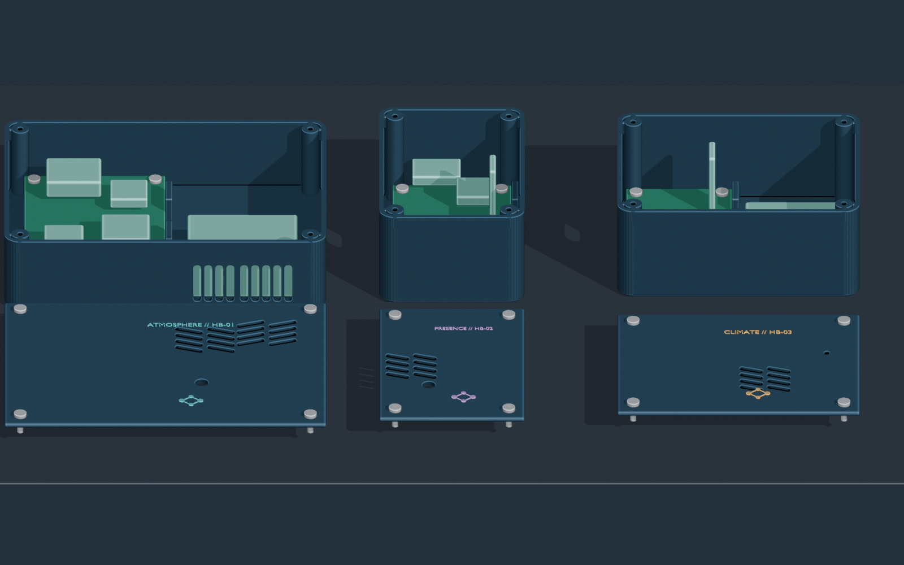

# HomeBrain sensor fleet — LinkedIn post

I’m building a three-device, HomeBrain-native sensor fleet from off-the-shelf ESP32-C6 hardware—and treating the whole project like a real product, not just a breadboard experiment.

🌬️ Atmosphere Air Station — true CO₂, PM1/2.5/10, temperature, humidity, pressure, ambient light, and relative VOC trends.

🧍 Presence Pod — 24 GHz mmWave detection for moving and stationary occupants, plus ambient light and climate sensing.

🌡️ Climate Pod — a cordless, deep-sleep temperature and humidity sensor with comfort, mold-risk, and battery telemetry.

All three run the same firmware image, with the hardware role selected during provisioning. HomeBrain handles registration, per-device authentication, remote configuration, health, telemetry history, and automation events.

Each device now has its own purpose-built motherboard. The purchased sensor modules solder directly into labeled footprints, while shared power, I²C, UART, and battery-sense connections are copper traces—no bundles of hand-wired jumpers. The one intentional exception is the PMS5003’s supplied keyed factory cable between its metal sensor and the red breakout soldered onto the Atmosphere board.

I also rebuilt the three Blender enclosures around those motherboards. Four ordinary #4 screws hold each PCB rigidly to printed plastic posts, two tall printed walls absorb USB insertion force, and four more identical screws close the separate lid. There are no heat-set inserts or specialty fasteners. The Atmosphere case has physically separated PM-sensor intake and exhaust paths; the Presence case has a thin 24 GHz radar window; and the Climate case isolates the protected LiPo from the antenna corridor.

The firmware, HomeBrain integration, Gerbers, net diagrams, actual-size footprint checks, and print-ready case files are generated from versioned design sources and independently validated. Next up: paper-fit verification against the delivered Amazon board revisions, PCB fabrication, assembly, calibration, and finding out what the first real-world data teaches us.

#ESP32 #IoT #HomeAutomation #3DPrinting #EmbeddedSystems #SmartHome

## Image alt text

Studio render of three navy HomeBrain sensor enclosure bodies arranged in a row. Each matching engraved lid is fully detached and placed below its enclosure. Green dedicated motherboards and their four silver mounting screws are visible inside, along with the Atmosphere airflow grille, sensor-specific lid openings, corner bosses, and recessed lid fasteners.
